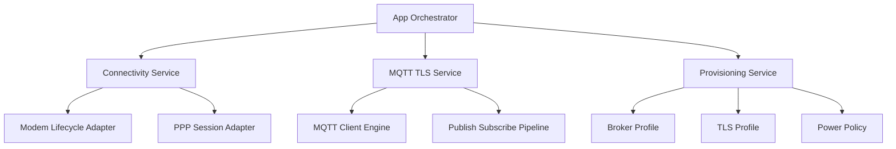
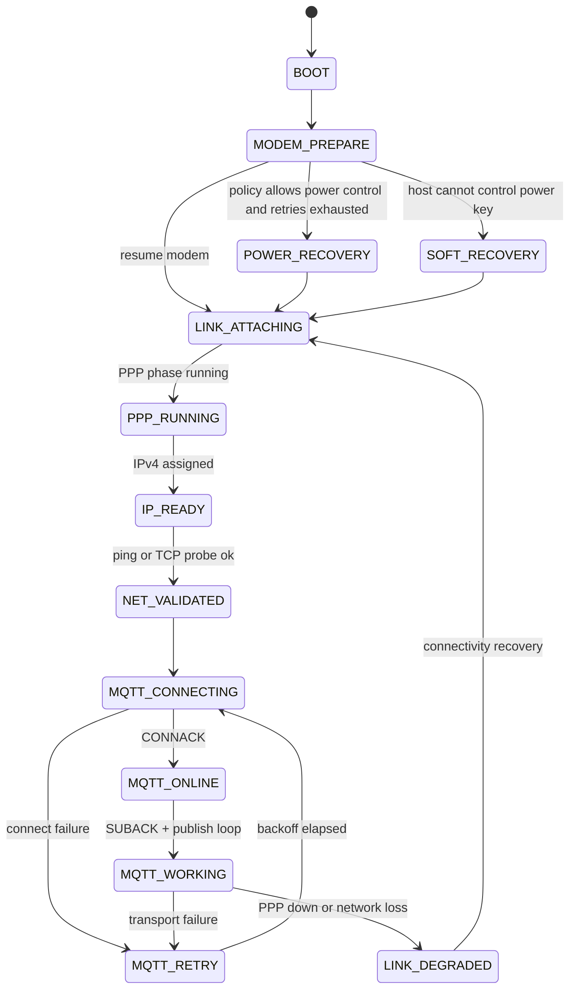

# PPP over UART + MQTT over TLS Application Architecture (Plan B)

## 1. Purpose and Scope

This document defines a production-oriented, customer-reusable architecture for:

- Cellular connectivity: PPP over UART (with CMUX)
- Application transport: MQTT over TLS
- Operational robustness: observability, retry, and layered recovery
- Deployment flexibility across two hardware profiles:
  - Profile A: Host cannot control modem power key (current test environment)
  - Profile B: Host can control modem power key through GPIO (possible customer environment)

## 2. Design Constraints

- The current test setup cannot drive modem power key signals.
- Customer hardware may support power key GPIO control, so power control must be policy-driven, not hardcoded in app logic.
- TLS behavior must support both demo-level bring-up and production-level certificate verification.
- Connectivity and business logic must remain decoupled so that protocol changes do not rewrite lifecycle logic.

## 3. Layered Architecture

### 3.1 App Orchestrator

Responsibilities:

- Controls startup and runtime phases
- Applies retry backoff and escalation rules
- Coordinates services without embedding protocol internals

### 3.2 Connectivity Service

Responsibilities:

- Manages modem resume/suspend lifecycle
- Manages PPP up/down, phase running, and IPv4 readiness
- Publishes normalized connectivity events to upper layers

### 3.3 MQTT TLS Service

Responsibilities:

- Handles MQTT connect/subscribe/publish/keepalive
- Performs MQTT-level reconnect and session recovery
- Emits application-level events (online/offline/subscribed/publish failure)

### 3.4 Provisioning Service

Responsibilities:

- Provides broker profile (host, port, topic, client identity)
- Provides TLS policy and credential source abstraction
- Provides power control policy (host-can-control vs host-cannot-control)

## 4. Power Control Policy (Critical)

Required policy enum:

- POWER_POLICY_HOST_UNAVAILABLE: host cannot drive modem power key
- POWER_POLICY_HOST_GPIO: host can drive modem power key via GPIO

Behavior:

- HOST_UNAVAILABLE mode:
  
  - No explicit power pulse or power cycle from app layer
  - Recovery depends on modem stack state machine and software retries
  - Emphasis on timeout control, reconnect loops, and graceful degradation

- HOST_GPIO mode:
  
  - Enables power pulse and controlled power cycle escalation
  - Uses power-cycle recovery only after retry thresholds are exceeded
  - Keeps the same software recovery path as HOST_UNAVAILABLE to avoid code fork

Power policy must be selected by Provisioning Service so business logic stays identical across customer hardware variants.

## 5. TLS Certificate Strategy

### 5.1 Where certificates are loaded

Recommended source priority:

1. Compile-time embedded CA (fastest initial integration)
2. File-based certificate loading (field replaceable)
3. Secure storage or secure element (recommended for production)

### 5.2 Is hardcoding allowed?

- Allowed for early demo and bring-up.
- Not recommended as the only long-term mechanism for customer delivery.
- Final design should keep certificate source replaceable behind Provisioning Service.

### 5.3 Production default

- Use TLS_PEER_VERIFY_REQUIRED by default.
- Load CA chain with tls_credential_add().
- Add client certificate/private key when mutual TLS is required.
- Ensure reliable device time (RTC, network time, or secure time source) for certificate validity checks.

## 6. Runtime State Model

## 7. Failure Scenarios and Recovery Responsibilities

This section answers practical field questions for real deployments.

### 7.1 Modem unexpected power loss

Expected symptom:

- PPP drops, modem becomes unresponsive or disappears temporarily.

Recovery by layer:

- Low layer (modem driver/state machine):
  
  - Detects link loss, CMUX/PPP teardown, and registration changes
  - Triggers recovery states and controlled retries

- Middle layer (Connectivity Service):
  
  - Detects PPP phase transition out of RUNNING
  - Re-enters LINK_ATTACHING sequence (resume + PPP bring-up)

- Application layer (Orchestrator):
  
  - Marks business channel degraded
  - Pauses outbound publish pipeline
  - Waits for CONNECTIVITY_EVT_IP_READY before restarting MQTT service

Escalation:

- If POWER_POLICY_HOST_GPIO is enabled, allow power-cycle escalation after retry budget is exhausted.
- If POWER_POLICY_HOST_UNAVAILABLE, continue software-only recovery with bounded backoff and fault reporting.

### 7.2 Host unexpected reset or power loss

Expected symptom:

- Modem may still be powered while host restarts.

Recovery by layer:

- Low layer:
  
  - Must tolerate modem-already-on conditions
  - Skip unsafe power toggles when modem status indicates already powered

- Middle layer:
  
  - Re-initialize modem/PPP state from clean host context
  - Re-establish PPP and detect current network state

- Application layer:
  
  - Re-create MQTT client session id and subscriptions
  - Replay required retained configuration or bootstrap messages

Key design rule:

- Host reboot is treated as a normal cold-start sequence with idempotent connectivity startup.

### 7.3 PPP already established, then network signal disappears

Expected symptom:

- Radio registration may flap; PPP may remain up briefly before degradation.

Recovery by layer:

- Low layer:
  
  - Periodic scripts and registration events track deregistration or PDN loss
  - Emits registration and connectivity events

- Middle layer:
  
  - Transitions from NET_VALIDATED/MQTT_WORKING to LINK_DEGRADED
  - Triggers PPP reconnect or full attach sequence as needed

- Application layer:
  
  - Stops publish bursts
  - Moves to offline queueing (optional)
  - Retries MQTT only after connectivity state returns to NET_VALIDATED or IP_READY

Operational recommendation:

- Keep application retry cadence slower than connectivity recovery cadence to avoid storming the network stack.

## 8. Bottom/Middle/App Layer Recovery Inventory

### 8.1 Bottom layer (driver and protocol stack)

- Modem state machine transitions (resume, init, cmux, dial)
- Timeout-driven script retries
- PPP phase event monitoring
- Registration and deregistration tracking
- Optional power pulse/power-off paths when hardware supports control

### 8.2 Middle layer (Connectivity and MQTT services)

- Unified connectivity state transitions
- Service-local retry with bounded exponential backoff
- Session-level reconnect coordination (avoid overlapping reconnect loops)
- Event normalization and fan-out to application observers

### 8.3 Application layer (Orchestrator and business logic)

- Business degradation mode (online/offline)
- Idempotent startup and restart behavior
- Store-and-forward or drop-policy for outbound telemetry when offline
- Escalation reporting (metrics, alarms, counters)

## 9. Suggested Public Interfaces

### 9.1 Connectivity Service API

- connectivity_start()
- connectivity_stop()
- connectivity_get_state()
- connectivity_register_observer(cb)

Event model:

- CONNECTIVITY_EVT_MODEM_READY
- CONNECTIVITY_EVT_PPP_RUNNING
- CONNECTIVITY_EVT_IP_READY
- CONNECTIVITY_EVT_LINK_LOST

### 9.2 MQTT TLS Service API

- mqtt_service_start(profile)
- mqtt_service_stop()
- mqtt_service_publish(topic, payload)
- mqtt_service_register_observer(cb)

Event model:

- MQTT_EVT_ONLINE
- MQTT_EVT_OFFLINE
- MQTT_EVT_SUBSCRIBED
- MQTT_EVT_PUBLISH_FAILED

## 10. Recovery Priority Order

Recommended escalation chain:

1. MQTT protocol recovery (reconnect/session restore)
2. PPP/link recovery (re-attach/re-dial)
3. Modem functional recovery (resume/restart)
4. Power-cycle recovery (only when power key control is available)

This sequence keeps behavior valid in both host-can-control and host-cannot-control environments.

## 11. Delivery Stages

- Demo stage:
  
  - Single broker profile
  - Embedded certificate source
  - Basic reconnect

- Customer delivery stage:
  
  - Replaceable certificate source
  - Strict TLS peer verification
  - Parameterized provisioning profile

- Production stage:
  
  - Secure key storage and optional mutual TLS
  - Robust telemetry for failures and recovery metrics
  - Policy-based recovery tuning per deployment

## 12. Conclusion

Plan B provides a clean, layered architecture that works in the current no-power-key lab setup and still reserves full recovery escalation for customer platforms with modem power control. It also explicitly defines which recovery actions belong to the bottom layer, middle layer, and application layer, which is essential for stable real-world operation.